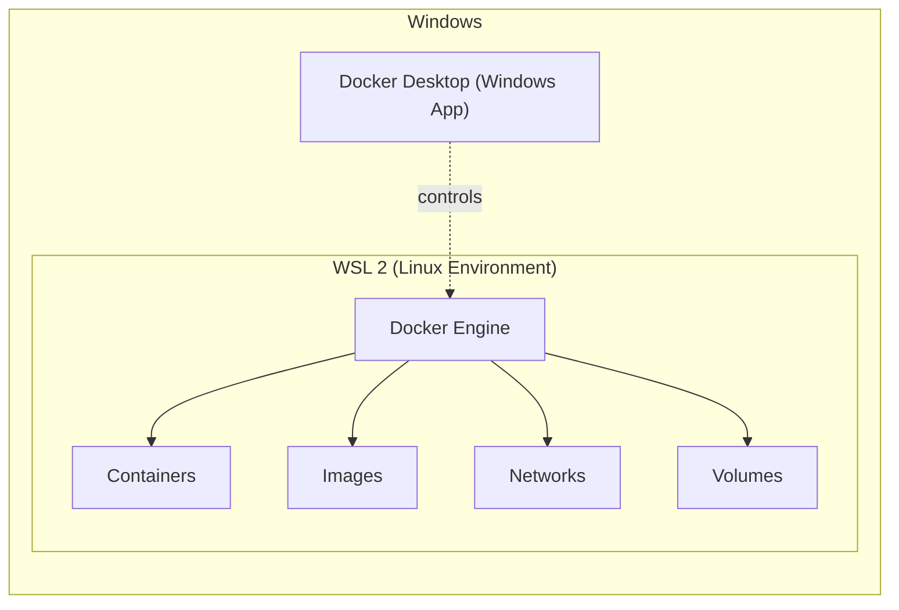

For the past month or so, I have spent a surprising amount of time with Docker; whether setting up my own projects, configuring it on other machines, or navigating the inevitable debugging sessions that come with Docker and WSL.

During these setups, people often asked me: _Why is Docker necessary? Why won't my local setup suffice as long as it works? And why do I need to deal with installing and updating WSL?_

Whenever I tried to answer, I’d replay the conversation in my head later and feel as though my explanation hadn't quite hit the mark. This post is my modest attempt to fix that and build a clean, step-by-step mental model for how Docker and WSL actually fit together.

## Why Docker Exists 
Let's say I build an application on my laptop.
It works perfectly.

I send it to a peer. They run it and something breaks. The project doesn't work on their machine.

There can be a variety of reasons for this: perhaps we're using different Python versions, a dependency is missing, a database is configured differently, or a system-level requirement wasn't installed. 

The application code is identical, but the underlying environments are not. Now we're debugging their computer instead of my application. And eventually someone says the most famous sentence in software:

> “But it works on my machine!”

Docker's basic idea is to make much of the application's environment part of what we're shipping.

Instead of expecting an application to work flawlessly across arbitrary machines, we define the runtime, libraries, dependencies, and application code it expects and package them into an image. The result is a more consistent environment in which the application can run. While that doesn't magically solve every edge case, it gives us a much more reproducible way of running software.

It's worth noting that Docker isn't necessary for every project; it becomes useful when consistency, reproducibility, isolation, or multi-service environments matter.

That's where containers come in. 

## So what is a container?

A container is an isolated process environment in which an application runs with its dependencies.
The easiest way to understand it is to compare it with a virtual machine.
A virtual machine looks roughly like:

```
Your computer
     ↓
Virtual machine
      ↓
Guest operating system
      ↓
Application
```

A container is more like:
```
Host OS 
      ↓
Container runtime
      ↓
Container
      ↓
Application
```
Please bear in mind that this is a simplified model. The exact architecture depends on the operating system and container runtime being used.

Containers don't include a complete guest operating system. Linux containers share the Linux kernel they run on, which is one reason they can be much lighter than full virtual machines.

The distinction matters because a container isn't a tiny virtual computer. It's simply a different way of isolating and running processes while sharing the underlying kernel.

## Then what's an image?

A Docker image is an immutable, packaged blueprint that Docker can use to create containers. It contains the filesystem, application code, dependencies, and configuration that are needed to create a container.

For example, an image might contain everything needed to run an application using:
- Python 3.12
- Flask
- Application dependencies
- Application code

The image itself is not the running application. When we run the image, Docker creates an active container from it.

```
Image
   ↓
Container
   ↓
Running application
```
Where do images come from? Usually, from a Dockerfile.  A Dockerfile is a set of instructions for building an image. For example:

```
FROM python:3.12

WORKDIR /app

COPY . .

RUN pip install -r requirements.txt

CMD ["python", "app.py"]
```


At first, this may look like another piece of Docker syntax. But read it as plain English:

- FROM python:3.12  → Start with Python 3.12.  
- WORKDIR /app  → Set `/app` as the working directory inside the container  
- COPY . . → Copy the project files into the image.
- RUN pip install -r requirements.txt  → Install the dependencies.  
- CMD ["python", "app.py"]  → When the container starts, run my application.   

So now we have:
```
Dockerfile
     ↓
   Image
     ↓
 Container
     ↓
Running application
```
An analogy that may be useful is:
- **Dockerfile** = architectural instructions
- **Image** = blueprint/package
- **Container** = building constructed from the blueprint 

It's not a perfect analogy, but it makes the relationship easy to remember.

#### Build vs run
This distinction is easy to miss when following a setup guide, but they operate at entirely different stages.

When you run:
```
docker build -t myapp .
```
It basically states: Take the instructions in my Dockerfile and create an image. Then:

```
docker run myapp
```

takes that image and starts a running container from it.

So:
```
             docker build
Dockerfile ───────────────→ Image
                              │
                              │ docker run
                              ↓
                           Container
```
## Scaling Up: Real Applications Need Multiple Containers

There is a slight catch here: real applications usually have more than one moving part. A standard setup might look like:
- Frontend
- Backend
- PostgreSQL
- Redis

Each service can run in its own container. You could manage them individually, but managing  several services that need to run and communicate with each other can get tedious rather quickly. 

Docker Compose allows you to describe your full multi-container architecture in a single configuration file and manage those services as a unified application stack. The file is commonly named compose.yaml, although docker-compose.yml is also widely used.

Conceptually:
```
              Docker Compose
                    │
        ┌───────────┼───────────┐
        ↓           ↓           ↓
    Frontend      Backend    PostgreSQL
    container    container    container
```

And instead of starting everything separately:

```bash
docker compose up
```

can bring the defined services up together.

The distinction is:
- **Docker:** Provides the container platform and tooling.  
- **Docker Engine:** The core container engine responsible for building and running containers.
- **Docker Compose:** Defines and manages a multi-container application as a group of services.

A few more pieces: 

Once the basic model makes sense, some of the other Docker terminology becomes easier to place.

### Volumes

Containers can be replaced or removed. But what if the application has a database? I probably don't want deleting the database container to delete all my data.
A volume provides persistent storage that can outlive a particular container. 

Data written to a container's writable layer is tied to that container whereas the  data stored in a volume can persist independently of the container.

For example:
```
PostgreSQL container
        │
        ↓
      Volume
        │
        ↓
   Database data
```
### Networks

Containers often need to communicate with each other.
For example:

Frontend
    ↓
Backend
    ↓
Database

A backend might need to talk to a database. A frontend might need to talk to a backend. Docker provides networking so these services can communicate with each other. At that point, the whole thing starts looking less like a collection of unrelated features and more like a system.

### Registries
Registries are essentially places where images are stored and shared (like Docker Hub, GitHub Container Registry, or AWS ECR). 

A useful rough analogy would be to think of it as GitHub, but for container images instead of source code.

## Why do I need WSL at all?

If you're developing on Windows, **WSL (Windows Subsystem for Linux)** may come into the picture, particularly if you're using Docker Desktop with the WSL 2 backend.

WSL stands for Windows Subsystem for Linux, and it lets you run a Linux environment inside Windows. WSL 2 does this using a real Linux kernel running in a lightweight virtualized environment.

This is useful because much of modern development tooling, including container tooling, is built around Linux.

This matters for Docker because Linux containers depend on Linux kernel features, and Windows itself does not provide a Linux kernel. WSL 2 provides the Linux environment that Docker Desktop can use in order to run Linux containers on Windows.

The simplest mental model is:
```
Windows
   │
   ├── Docker Desktop
   │       │
   │       └── integrates with WSL 2
   │                │
   │                └── Linux environment
   │                       │
   │                       └── Linux containers
   │
   └── Windows applications
```
The actual implementation is more involved than this diagram, but this distinction is useful when debugging. A problem that looks like a Docker problem may sometimes be related to the Linux environment underneath it.

You can work with Linux tools and commands without replacing Windows as your operating system.

If you're using Docker Desktop on Windows, Docker Desktop handles much of the integration between Docker, Windows, and WSL 2.

That's why WSL 2 can become an important part of the setup and an important part of the debugging process.

## The Complete Mental Model
Putting all these pieces together leaves us with a tidy architectural and workflow map:



The important thing is that these aren't separate concepts to memorize. They fit together:
```
Dockerfile
    │
    │ docker build
    ↓
  Image
    │
    │ docker run
    ↓
Container
    │
    ↓
Running application
```
There's of course, far more to explore: networking details, storage drivers, security, and orchestration with tools like Kubernetes. But once this basic structure is clear, the rest becomes much easier to connect.
